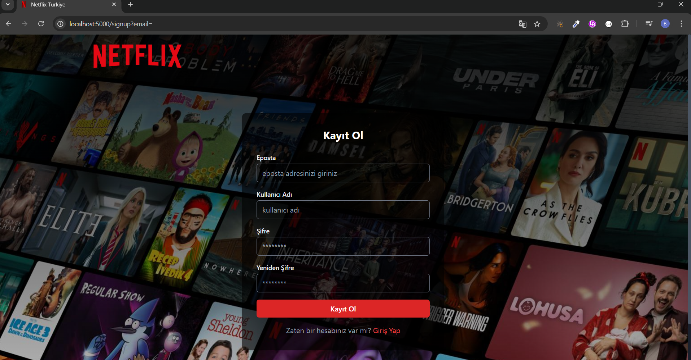
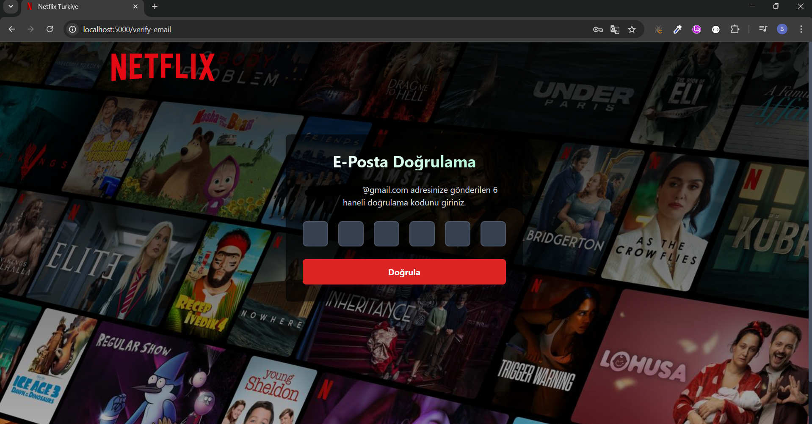
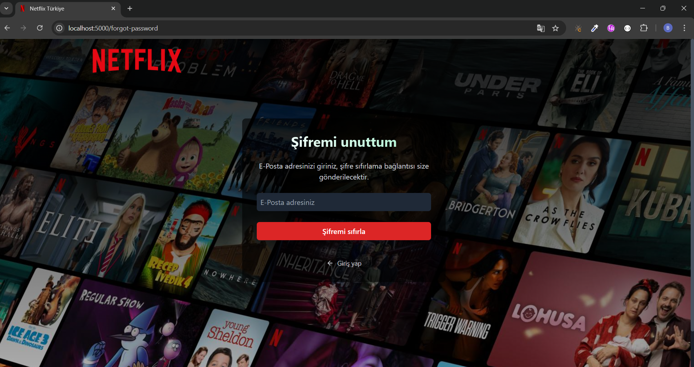
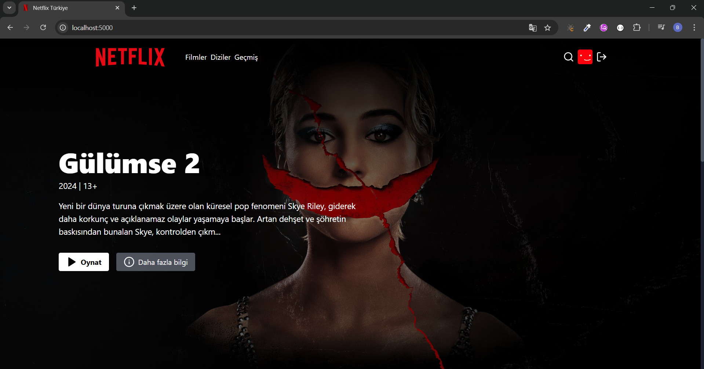
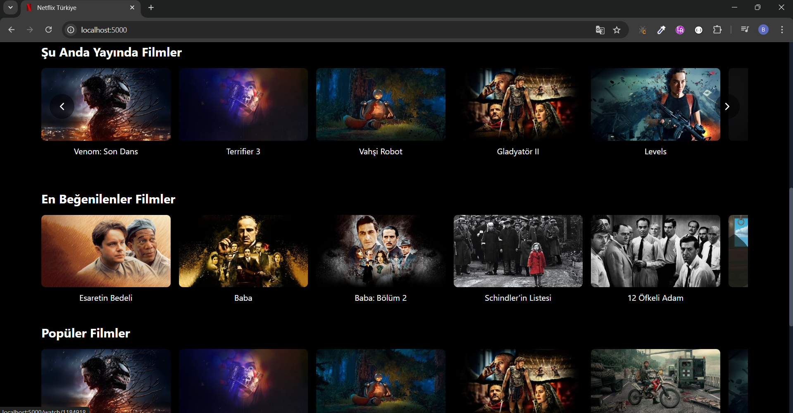
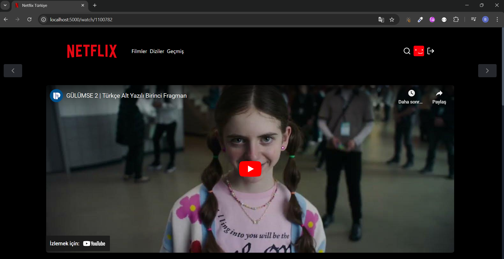
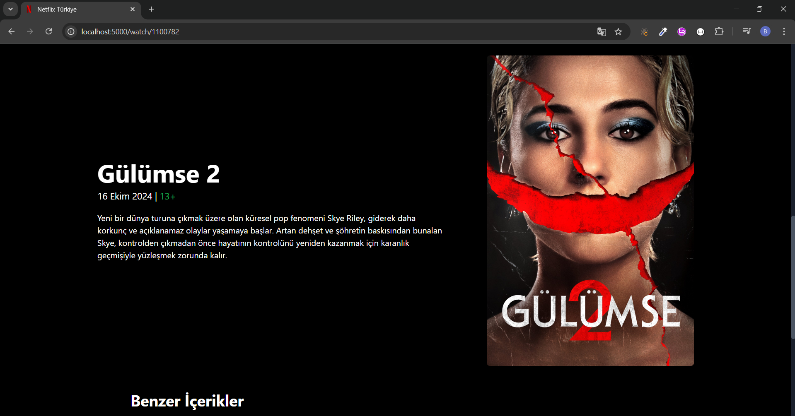
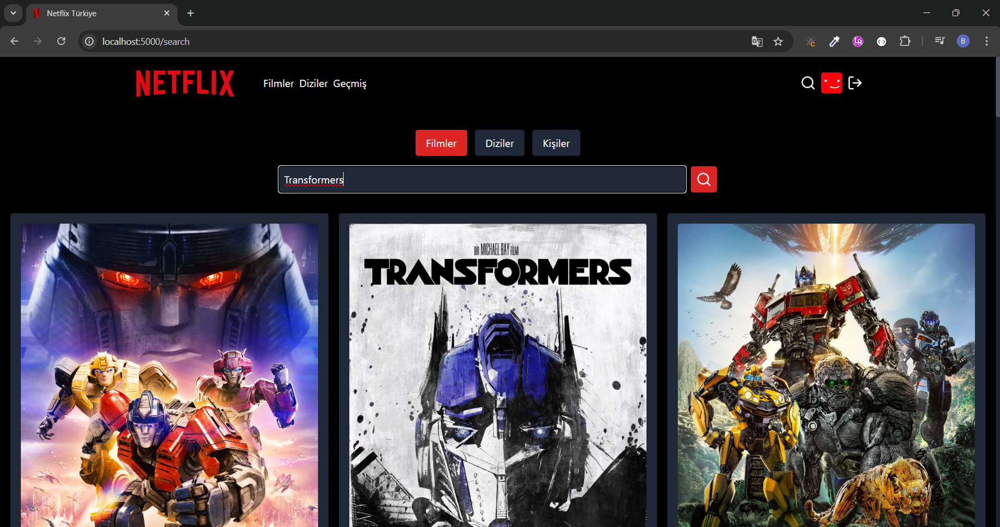
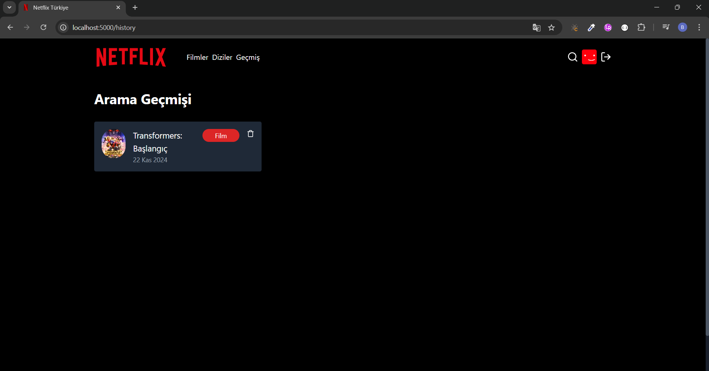

# Netflix Clone

Modern web teknolojileri kullanılarak geliştirilmiştir.

Bu proje MERN stack (MongoDB, Express.js, React.js, Node.js) kullanılarak oluşturulmuştur.

## 📸 Ekran Görüntüleri

### Ana Sayfa


### Kayıt Olma Sayfası



### E-posta Doğrulama Sayfası



### Şifre Sıfırlama Sayfası

 

### Filmler Sayfası

 

### İzleme Sayfası

 

### Arama Sayfası

 

## 🚀 Özellikler

- 🔐 JWT tabanlı kimlik doğrulama sistemi
- ✉️ Mailtrap ile email doğrulama
- 🎥 TMDB API entegrasyonu ile film ve dizi verileri
- 🔍 Gelişmiş arama özellikleri (Film, Dizi, Kişi)
- 📱 Responsive tasarım
- 🌙 Dark mode
- 🎬 Video oynatıcı
- 📜 Arama geçmişi
- 🔄 Şifre sıfırlama sistemi

## 🛠️ Teknolojiler

### Frontend

- React.js
- Tailwind CSS
- Zustand (State Management)
- Axios
- React Router
- React Hot Toast

### Backend

- Node.js
- Express.js
- MongoDB
- JWT
- Mailtrap
- Bcrypt.js

## 🚀 Kurulum

1. Projeyi klonlayın

2. Gerekli paketleri yükleyin

```bash
npm install
```

3. `.env` dosyasını oluşturun ve gerekli değişkenleri ekleyin

```bash
MONGO_URI=your_mongodb_uri
JWT_SECRET=your_jwt_secret
TMDB_API_KEY=your_tmdb_api_key
MAILTRAP_ENDPOINT=your_mailtrap_endpoint
MAILTRAP_TOKEN=your_mailtrap_token
CLIENT_URL=your_client_url
NODE_ENV=development
PORT=5000
```

4. Derleme işlemini gerçekleştirin

```bash
npm run build
```

5. Projeyi başlatın

```bash
npm run start
```
